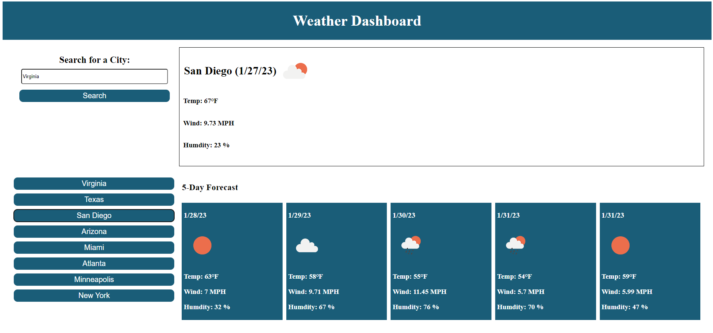

# Desctiption 

The goal for this challenge is to create a weather dashboard that will showcase current and future weather conditions for cities. To build this dashboard, I used a third party API called OpenWeather to access specific data points by initating a Fetch request. Using the API allowed me to pull in information such as the temperature, the humidity and the wind speed. I presented this information to the user each time they searched for a city. I was also able to save there past search history to save them a step in the future. 

Here is the link to my page: 

## Installation 
N/A

## Usage 

Here is the link to my github repository: https://github.com/aliyajeylani/weather_dashboard

## Credits

N/A

## License

N/A